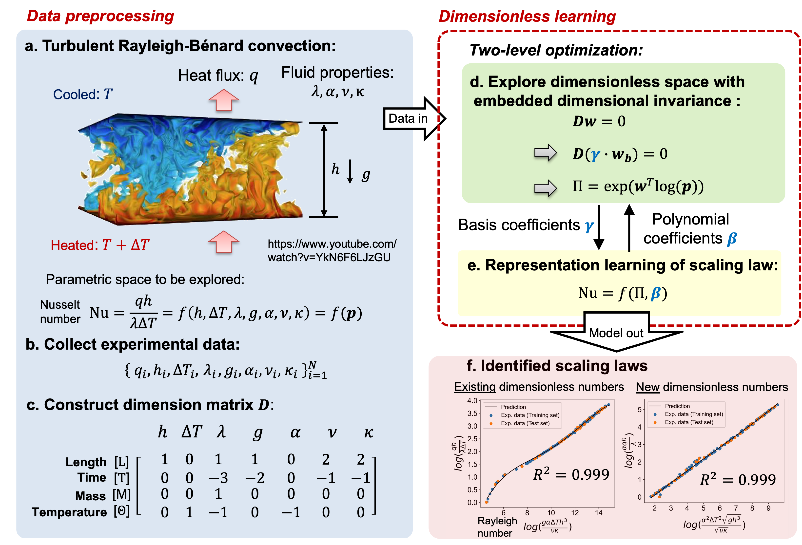

# Welcome to PyDimension Documentation!



## Overview of Dimensionless Learning

Dimensionless learning combines fundamental physics principles with state-of-the-art machine learning techniques to solve scientific and engineering problems. By embedding the principle of dimensional invariance into a two-level machine learning scheme, it can automatically discover dominant dimensionless numbers and governing laws (scaling laws and differential equations) from noisy and scarce measurements. This approach allows us to reduce high-dimensional parameter spaces and simplify complex processes, while still retaining a physically interpretable and accurate representation of the system. The detailed advantages are shown bwlow:

- **Dimension reduction**: 
  - Dimensionless leanring can reduce a large number of parameters to a few dominant dimensionless numbers.
- **Better interpretability**: 
  - The identified dimensionless can be interpreted as the ratio of different forces, velocities, or energies, etc.
  - Lower dimension also allow for qualitative and quantitative analysis of the systems of interest. 
- **Works well in small dataset**: 
  - By incorporating **fundamental physical knowledge** of dimensional invariance, the learning space is limited to a manageable size, which makes it possible to train well-performing models using scarce datasets.
- **Better generalization**:
  - Another benefit for embedding physical invariance is that the learned model have a better generalization in data with different materials and scales.

## Toturials

```{tableofcontents}
```

## Code
You can find the code at [PyDimension](https://github.com/xiaoyuxie-vico/PyDimension).

## Paper

This work was published at ***Nature Communications*** on December 2022. You can find the paper at [here](https://www.nature.com/articles/s41467-022-35084-w#Sec2).

## Citation
If you find the code helpful, please cite our paper.
```
@article{xie_data-driven_2022,
  title = {Data-driven discovery of dimensionless numbers and governing laws from scarce measurements},
  volume = {13},
  url = {https://www.nature.com/articles/s41467-022-35084-w},
  doi = {10.1038/s41467-022-35084-w},
  number = {1},
  urldate = {2022-12-08},
  journal = {Nature Communications},
  author = {Xie, Xiaoyu and Samaei, Arash and Guo, Jiachen and Liu, Wing Kam and Gan, Zhengtao},
  month = dec,
  year = {2022},
  pages = {7562},
  publisher={Nature Publishing Group}，
}
```

## Contact

This online documentation is being developed. If you have any questions, suggestions, or would like to contribute to or collaborate on this repository, please contact the developer [Xiaoyu Xie](https://xiaoyuxie.top/) at Northwestern University via email xiaoyuxie2020@u.northwestern.edu.

This work is supervised by [Prof. Wing Kam Liu](https://www.mccormick.northwestern.edu/research-faculty/directory/profiles/liu-kam-wing.html), Walter P. Murphy Professor of Mechanical Engineering & Civil and Environmental Engineering, Northwestern University, Evanston, Illinois, USA.
